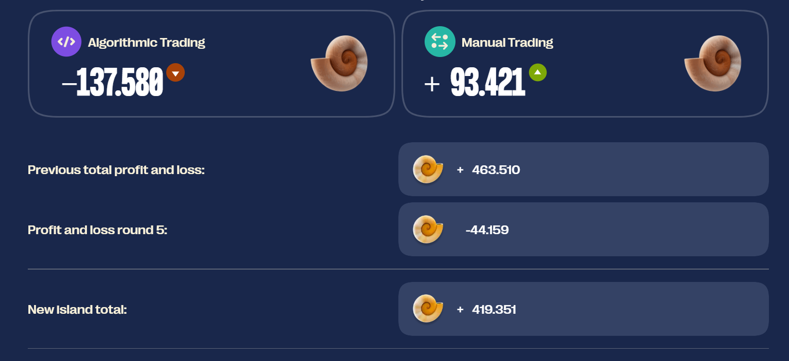

# 2025-IMC-Global-Trading-Challenge
**Final Rank: 441 / 12,600 Teams**

\
Over 15 days, I participated in Prosperity 3, an algorithmic trading competition hosted by IMC Trading. Each of the five rounds provided participants with 72 hours to design and code a trading strategy tailored to a new set of products. This year proved especially challenging, with more teams, more products, and tighter timelines. Balancing a busy school and work schedule, I was only able to dedicate 2–3 hours per day to the competition. Nonetheless, I am documenting my approach and results below.

- [Round 1](#round-1) - Market Making
- [Round 2](#round-2) - ETF Arbitrage
- [Round 3](#round-3) - Options Trading
- [Round 4](#round-4) - Exchange Arbitrage
- [Round 5](#round-5) - Counterparty Trading 

## Round 1 - **[Submission Code](https://github.com/edmund870/2025-IMC-Global-Trading-Challenge/blob/main/Submissions/Round_1_final.py)**

**Products Traded: `RAINFOREST_RESIN`, `KELP`, `SQUID_INK`**

For `RAINFOREST_RESIN`, the price remained stable around a fair value of 10,000. Thus, the strategy focused on market taking and market making around this fair price.

For `KELP`, time series analysis revealed that the first-differenced mid-price followed a Moving Average (MA(1)) process. Consequently, we employed an MA(1) model to predict the next mid-price and based market making on the forecasted value. The model incorporated exogenous variables, such as:

Most Mid Price: the mid-price at the quote level with the largest volume.

Most Micro Price, defined as:

$$
\text{Most Micro Price} = \frac{(\text{Most Ask} \times \text{Most Bid Volume}) + (\text{Most Bid} \times |\text{Most Ask Volume}|)}{|\text{Most Ask Volume}| + \text{Most Bid Volume}}
$$
 
To dynamically update model parameters, gradient descent was implemented to maximize the log-likelihood function of the MA(1) model.

For `SQUID_INK`, a linear regression model was fitted with the mid-price of `KELP` as the predictor 𝑋 and the mid-price of `SQUID_INK` as the response 𝑌. The model was used to forecast the next mid-price of `SQUID_INK`. The difference between the predicted and current mid-price was standardized into a Z-score based on historical spread statistics. If the Z-score exceeded a predefined threshold, directional trading (rather than market making) was executed.

**Round 1 Results: 79 / 12,600** 

### Post-Round Thoughts
Round 1 results were satisfactory. I had additional time to refine the strategies for `RAINFOREST_RESIN` and `KELP`, as these products were available during the tutorial phase.

## Round 2 - **[Submission Code](https://github.com/edmund870/2025-IMC-Global-Trading-Challenge/blob/main/Submissions/Round_2_final.py)**

**New Product Traded: `CROISSANTS`, `JAMS`, `DJEMBES`, `PICNIC_BASKET1`, `PICNIC_BASKET2`**

Round 2 introduced five products and focused on ETF arbitrage. The ETFs, `PICNIC_BASKET1` and `PICNIC_BASKET2`, were composed as follows:

- `PICNIC_BASKET1`: 6 `CROISSANTS`, 3 `JAM`, and 1 `DJEMBES`

- `PICNIC_BASKET2`: 4 `CROISSANTS` and 2 `JAM`

This round tested mean reversion between the ETF prices and their underlying assets. At each iteration, the premium or discount of the ETF relative to its underlying was calculated, and a corresponding Z-score was computed. If the Z-score exceeded a predefined threshold, I would short or long the ETF, anticipating mean reversion.

A Vector Error Correction Model (VECM) was also applied to the ETFs as a confirmation signal — predicting whether the next mid-price movement aligned with the direction suggested by the Z-score before executing a trade.

For the underlying assets, VECM was used to identify and trade cointegrated pairs. Based on the Johansen cointegration test, the following pairs were found to be cointegrated:

- `CROISSANTS` & `PICNIC_BASKET1`

- `JAM` & `PICNIC_BASKET1`

- `DJEMBES` & `PICNIC_BASKET1`

Trading signals on the underlying were generated by normalizing the predicted price changes (deltas) into Z-scores, with parameters hard-coded for simplicity.

Adjustments to Round 1: Further EDA revealed that `KELP` no longer exhibited the same stationarity properties observed earlier. As a result, a VECM model was applied instead, with `KELP` and `SQUID_INK` identified as a cointegrated pair.

**Round 2 Results: 428 / 12,600** 

### Post-Round Thoughts
Round 2 saw a drop in rankings. Trading the underlying products of the ETFs proved unprofitable, and the strategy adjustment for `KELP` did not perform as well as expected. Additionally, `PICNIC_BASKET2` significantly underperformed.

## Round 3 - **[Submission Code](https://github.com/edmund870/2025-IMC-Global-Trading-Challenge/blob/main/Submissions/Round_3_final.py)**

**New Products Traded: `VOLCANIC_ROCK`,`VOLCANIC_ROCK_VOUCHER_9500`, `VOLCANIC_ROCK_VOUCHER_9750`, `VOLCANIC_ROCK_VOUCHER_10000`, `VOLCANIC_ROCK_VOUCHER_10250`, `VOLCANIC_ROCK_VOUCHER_10500`**

Round 3 introduced six products, focusing on options trading and volatility arbitrage.

My initial instinct was to explore potential arbitrage opportunities, such as:

Intrinsic Value Arbitrage: The call option price must be greater than its intrinsic payoff.

Butterfly Arbitrage: A butterfly spread must always be priced positively.

Bull Call Spread Arbitrage: Longing a lower strike and shorting a higher strike should yield a net cost lower than the expected payout.

However, these pure arbitrage opportunities were rare and exit conditions were unclear.

I then shifted to using implied volatility to identify option mispricings, similar to my approach from the previous year. A late hint provided by IMC suggested the following:

Compute, for each time 𝑡:

$$
m_t = \frac{\log(K/S_t)}{\sqrt{\text{TTE}}}
$$

$$
v_t = \text{Black-Scholes Implied Volatility}(S_t, V_t, K, \text{TTE})
$$

Plotting implied volatility against moneyness and fitting a parabolic (quadratic) curve helps filter out random noise. The fitted curve allows evaluation of relative mispricings across strikes.

Using this fitted curve, I computed the theoretical implied volatility for each strike and compared it against the actual implied volatility (computed by applying the Black-Scholes model and Newton-Raphson method).
If the actual implied volatility was greater than the theoretical, I would short the option, and vice versa.

Drawing from past experience, I avoided delta-hedging, as it often capped profits in a competitive setting.
Instead, I reverse-engineered the theoretical underlying price from the nearest at-the-money option's mid-price and traded based on the derived price.

**Round 3 Results: 41 / 12,600**

### Post-Round Thoughts
The PnL graph was highly volatile. Upon investigation, I realized the code had shorted nearly all the options and the underlying, leading to the unexpected result.
Despite a significant jump in rankings, this outcome was unintended, and there remains considerable room for improvement.

## Round 4 - **[Submission Code](https://github.com/edmund870/2025-IMC-Global-Trading-Challenge/blob/main/Submissions/Round_4_final.py)**

**New Products Traded: `MAGNIFICENT_MACARONS`**

Round 4 introduced MAGNIFICENT_MACARONS, focusing on identifying arbitrage opportunities between two marketplaces: Archipelago and Pristine Cuisine.
Key factors included import/export tariffs, transportation costs, and storage costs.

When buying MAGNIFICENT_MACARONS from Pristine Cuisine, trades were executed at the ask price, incurring transportation fees but benefiting from import tariffs:

$$
\text{pristine buy} = \text{conv ask} + \text{transport fees} + \text{import tariff}
$$

When selling to Pristine Cuisine, trades were executed at the bid price, incurring transportation fees and export tariffs:

$$
\text{pristine sell} = \text{conv bid} - \text{transport fees} - \text{export tariff}
$$

Analysis revealed that MAGNIFICENT_MACARONS were cointegrated with the mid-price at Pristine Cuisine and the sunlightIndex. Thus, a VECM model was applied to predict trading signals. Each time a buy or sell signal was detected, I compared the effective trading prices between Archipelago and Pristine Cuisine to execute the most profitable trade.

**Round 4 Results: 281 / 12,600** 

### Post-Round Thoughts
Round 4 did not perform as expected. The majority of products began to lose seashells, resulting in negative performance overall.

## Round 5 - **[Submission Code](https://github.com/edmund870/2025-IMC-Global-Trading-Challenge/blob/main/Submissions/Round_5_final.py)**
**New Product Traded: -**

**Counterparty Trades were revealed**

In Round 5, counterparty trades were revealed, enabling further strategy improvements.

I analyzed the trades of each counterparty by plotting quantities over time and identifying which counterparties consistently generated steady, positive PnL.

Based on this analysis, I implemented a trade_with and trade_against parameter for each product — trading with profitable counterparties and taking the opposite side against those who consistently incurred losses.

**Round 5 Results: 441 / 12,600** 

### Post-Round Thoughts
Unfortunately, another round with negative profits. It seems I may have overly focused on identifying counterparties. Applying too many filters, especially on specific trades and quantities, proved too granular. A higher-level overview would likely have been more effective. There is still significant room for improvement across most of the products.

### Final Thoughts

Despite the time constraints, Prosperity 3 was an enriching and eye-opening experience in the world of market making and trading products with diverse characteristics. Some of the concepts I experimented with didn’t work as intended, and due to time limitations, I couldn't test more alternatives. It became clear that the VECM model implementation wasn't as effective as expected, and I still have a lot to learn, particularly in options trading. Nonetheless, this has been an invaluable and memorable experience.

Coming back stronger for Prosperity 4 next year! :muscle:
